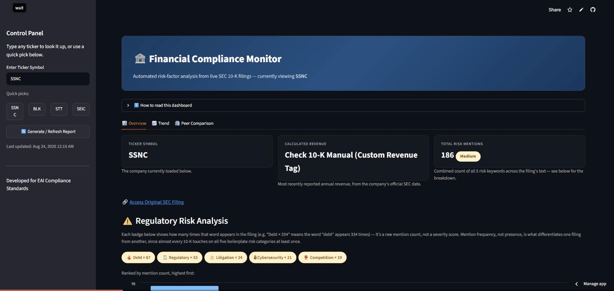
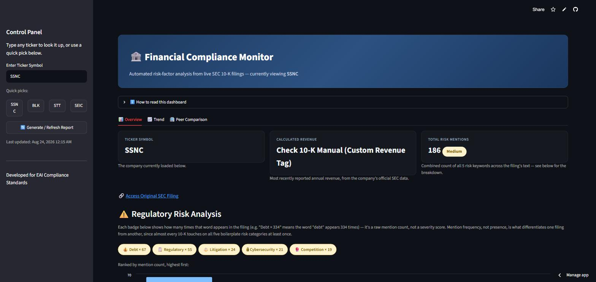
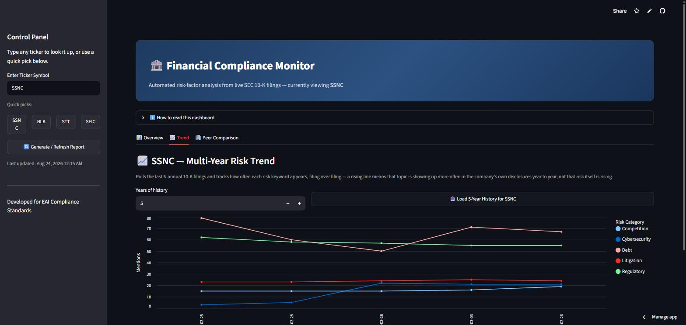
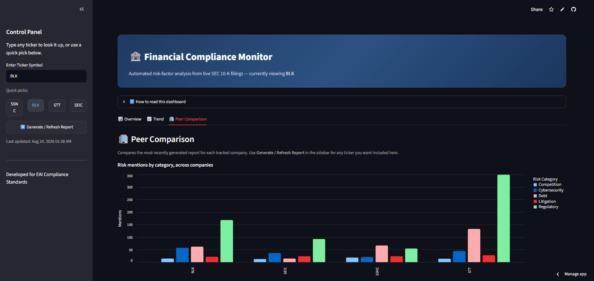

# Financial Compliance & Risk Monitor

Live app: https://mwpeery-financial-compliance-monitor.streamlit.app/

A Streamlit dashboard that pulls a company's 10-K filings straight from SEC EDGAR and counts how often it mentions five common risk topics: litigation, regulatory, cybersecurity, debt, and competition. Almost every 10-K touches on all five somewhere in the boilerplate, so a plain yes/no check doesn't tell you much — how often a topic comes up, and where, is more useful.



## What it does

- Pulls the latest 10-K for a ticker and shows revenue plus risk-keyword counts, with the surrounding sentence for context.
- Pulls the last several years of filings for one company and charts how those keyword counts move over time.
- Compares risk mentions and revenue across companies that you pick, side by side.
- Caches processed filings locally so it isn't re-downloading the same filing from EDGAR every time.
- Retries EDGAR requests a couple times before giving up instead of just crashing.

## Screenshots

**Overview** — the latest filing for one company, with revenue and risk-keyword counts in context.



**Trend** — the same risk keywords tracked across several years of filings for one company.



**Peer Comparison** — risk mentions and revenue lined up across whichever companies you've pulled reports for.



## How it's built

The data flow is EDGAR → script1.py → cache/JSON → Streamlit.

`script1.py` does the actual work and has no Streamlit dependency, so it also runs on its own from the command line. For a ticker, it resolves the company on EDGAR, pulls the 10-K(s), strips the HTML down to plain text, and counts risk-keyword hits with a bit of surrounding context for each one. Revenue comes from the filing's XBRL facts, falling back through a short list of tags since companies don't all report it under the same one.

Processed filings are cached to disk, keyed by ticker and accession number, so pulling the same filing twice doesn't mean hitting EDGAR twice — that matters most for the Trend tab, which can mean five separate filings for one company. Network calls to EDGAR retry a couple of times with backoff before giving up, since a single flaky request shouldn't crash the whole app.

The output is a couple of JSON files per ticker (`{TICKER}_report.json`, `{TICKER}_history.json`), and `app.py` just reads those and renders them across the three tabs — it doesn't touch EDGAR or the cache directly. That split is also what makes the test suite possible: the parsing and keyword-counting logic in `script1.py` is tested with no network calls at all, and `app.py` stays thin enough that it doesn't need its own tests.

## Running it

```bash
pip install -r requirements.txt
streamlit run app.py
```

To pull a report from the command line instead of the UI:

```bash
python script1.py SSNC
python script1.py --history SSNC   # last 5 years of filings
```

## Tests

```bash
pip install -r requirements-dev.txt
pytest
```

No network calls in the test suite — just the keyword-matching, HTML-cleaning, and caching logic. Runs in CI on every push and PR.

## Built with

Python, Streamlit, pandas, Altair, edgartools, pytest.
